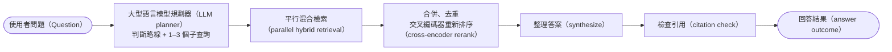
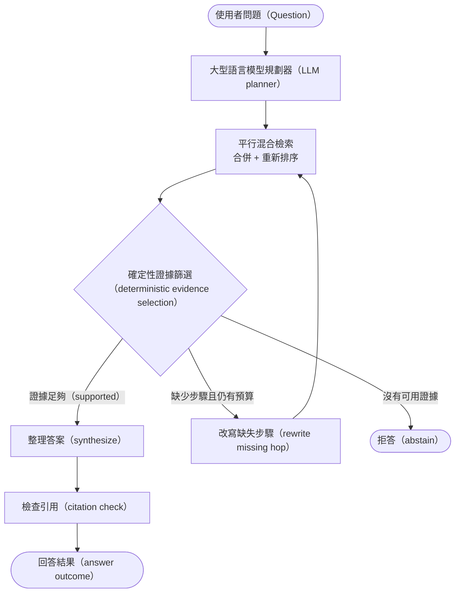
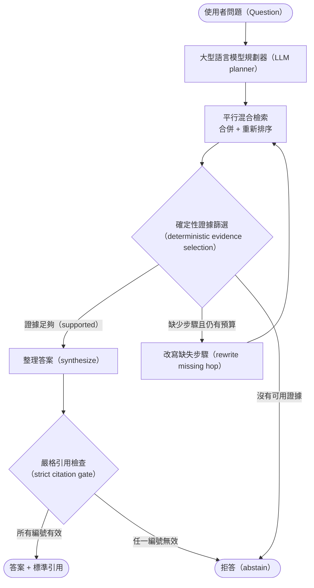
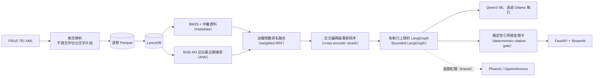

# FRUS Agentic RAG 策略評估

> 在 30 萬份外交史料上，測試哪些 RAG 元件真的值得它增加的成本。

這個專案的核心目的，是在探討本機資源受限的環境（單張 RTX 4060 8GB）與封閉語料下，如何透過架構設計來提升小模型的 RAG 表現。
測試多個流程查詢規劃（query planning）、多查詢檢索（multi-query retrieval）、證據篩選（evidence selection）、修正後再檢索（corrective retrieval）與引用檢查關卡（citation gate），哪些真的能改善結果？

目前專案處於**評估與收斂階段**。

已完成：全量 FRUS 語料、混合檢索、B0–B3 流程圖（graph）、服務介面與追蹤都已完成。

第一輪 350 次執行的消融實驗（Ablation Study）初步顯示->
查詢規劃能提高多步查找的證據覆蓋，但更複雜的下游節點反而抵銷了增益。

下一輪將用對等檢索預算與獨立的 R0–R3 實驗，確認增益究竟來自規劃品質，還是單純來自更多次搜尋。

本專案實驗建立在能清楚指出每個增益與損失發生在哪一層；這個程式庫（repository）保留失敗實驗、原始評測與預先定義的退場條件，目標是最後選出**最小、可驗證、在本機硬體上可維運**的 RAG 組裝，而不是替最複雜的流程圖（graph）找一個漂亮分數。

## 專案概況（Project Snapshot）

| 項目 | 現況 |
| --- | --- |
| 語料庫（Corpus） | 552 個已出版卷次、306,016 份歷史文件 |
| 索引（Index） | 723,557 個文字片段（chunks）；BM25、BGE-M3 向量檢索（dense retrieval）、交叉編碼器重新排序（cross-encoder rerank） |
| 回答生成（Generation） | Qwen3 4B Instruct Q4，透過本機 Ollama 執行 |
| 流程編排（Orchestration） | LangGraph 型別化狀態圖（typed StateGraph），具明確預算與終止條件 |
| 評估（Evaluation） | 35 題 × 中英雙語 × 5 個系統 = 350 次執行 |
| 硬體（Hardware） | RTX 4060 Laptop 8GB；全量 BGE-M3 向量化（embedding）已完成 |
| 目前進度（Current phase） | B 系列 v1 完成；證據篩選器（selector）、引用格式規則（citation protocol）與 R 系列實驗進行中 |

語料固定於原始 FRUS 版本（source commit）`4b4c402f0cce25144ded2198ba9566b6c37c7c49`。

線上回答只允許兩種結果：引用實際檢索到的 FRUS 文件，或明確拒答。正式問答路徑不使用網路搜尋，也不讓模型自行產生網址（URL）。

## 研究內容

代理式 RAG（Agentic RAG）很容易「看起來更聰明」，卻同時增加延遲、模型呼叫與失敗面。這個專案把問題拆成四個可反駁的假設：

1. 大型語言模型規劃器（LLM planner）是否比單次原始查詢找到更多多步查找（multi-hop）證據？
2. 證據篩選（evidence selection）是否真的移除雜訊，而不是誤刪正確文件？
3. 修正後再檢索（corrective retrieval）是否能補回缺失步驟（hop），而不是重複搜尋同一批內容？
4. 嚴格引用檢查（strict citation gate）是否能降低錯誤引用，且不造成過量拒答？

 B0–B3 是一組逐步加入能力的消融實驗；保留固定兩步式流程（2-step pipeline）對照組，作為實驗比較基準。

## B0–B3：代理流程圖（Agent graph）消融實驗

| 系統 | 新增策略 | 要回答的問題 |
| --- | --- | --- |
| B0 | 規則式路線判斷（rule-based routing）、單一原始查詢 | 最小流程圖（graph）能做到什麼？ |
| B1 | 模型判斷路線並拆分問題（LLM route + query decomposition） | 多查詢規劃是否提高證據覆蓋？ |
| B2 | 確定性證據篩選與有限次修正（deterministic evidence selection + bounded correction） | 篩選與一次修正能否補回缺失步驟（hop）？ |
| B3 | 阻斷式引用檢查（blocking citation gate） | 嚴格引用治理是否值得額外拒答？ |

所有流程圖（graph）都受同一組硬限制：最多 3 個子查詢（subquery）、2 輪檢索、1 次修正重搜（correction）與 3 次模型呼叫（LLM call）。預算檢查寫在條件分支（conditional edges），而不是期待模型自己停止。

### B0——規則分流後單次檢索（Rule-routed single retrieval）

B0 不呼叫大型語言模型規劃器（LLM planner）。它保留原始問題，以規則選擇精確查找（lookup）、時間軸查找（timeline）、出版狀態查詢（status）或一般混合搜尋（hybrid search），檢索一次後直接整理答案。


### B1——規劃後的多查詢檢索（Planned multi-query retrieval）

B1 加入大型語言模型規劃器（LLM planner），將問題轉成 1–3 個英文子查詢（subquery），平行檢索後合併、去重並重新排序；不做證據篩選（evidence selection），也不啟動修正迴圈（correction loop）。



### B2——證據篩選與一次修正重搜（Evidence selection with one correction）

B2 在 B1 後加入確定性分數篩選。若某個步驟（hop）缺乏足夠證據，流程圖（graph）最多改寫並重搜一次；預算用盡後只能用已接受證據作答或拒答。



目前證據篩選器（selector）的分數門檻（score threshold）尚未校準，因此目前預設為全部保留（keep-all）；在門檻設定前，B2 的修正分支（correction edge）雖然存在，卻不應被宣稱為已驗證有效。

### B3——嚴格引用治理（Strict citation governance）

B3 使用與 B2 相同的規劃、檢索與修正路徑，差別在最後一個確定性檢查關卡：任何不存在、未檢索到或不符合 FRUS 標準格式（canonical format）的證據編號（evidence ID），都會阻止答案輸出。



這個檢查關卡（gate）驗證的是來源可追溯性（provenance），不是語義正確性；「引用存在」不等於「引用足以回答問題」。無法回答問題的判定（unanswerable detection）仍需獨立測試。

## 實驗現階段：目前知道什麼

以下為現階段的確定性流程指標。以下數據 B2/B3 仍使用後來證實會誤刪標準答案文件（gold documents）的模型證據評分器；目前程式已改成確定性篩選器（deterministic selector），但尚未完成新一輪消融實驗。標準答案題目是從同一語料機器草擬作為回歸測試訊號，並非正式外部歷史問答基準測試（benchmark）。

| 系統（System） | 代理檢索聯集召回率（Agent union recall） | 多步檢索聯集召回率（Multi-hop union recall） | 引用召回率（Citation recall） | 平均檢索次數（Mean retrieval calls） |
| --- | ---: | ---: | ---: | ---: |
| B0 | 0.728 | 0.733 | **0.564** | **1.00** |
| B1 | **0.792** | **0.975** | 0.506 | 1.80 |
| B2 | 0.792 | 0.975 | 0.444 | 3.20 |
| B3 | 0.792 | 0.975 | 0.458 | 3.26 |

### v1 可重現性錨點（reproducibility anchors）

| 紀錄項目（Artifact） | 固定版本（Pinned value） |
| --- | --- |
| 代理流程／檢索程式與提示詞（prompts） | `66a03d2cc93c6e83ff4288dcf7d315a608187ff5` |
| FRUS 來源快照（source snapshot） | `4b4c402f0cce25144ded2198ba9566b6c37c7c49` |
| 評估題組（Evaluation set） | `eval/gold_cases.jsonl`, SHA-256 `d0bc30bf0a819448a924b2d8ee0cbf31174d83092c7ca0d1e9943bfab4e57102` |
| 回答模型（Generator） | `qwen3:4b-instruct`，透過 Ollama 執行；隨機度（temperature）`0.0` |
| 輔助評分模型（Auxiliary judge） | `gemini-3.5-flash-lite`；只作探索性分析，不作唯一品質證據 |
| 完整參數與原始結果（raw results） | `reports/v1-chunk-grader/agent_ablation.json`、`ablation_runs.jsonl` |

這輪結果支持三個暫時結論：

- **已驗證：查詢規劃找到更多多步標準答案文件。** B1 的多步檢索聯集召回率（multi-hop union recall）比 B0 高 24.2pp。
- **尚未驗證：增益是否來自更好的規劃。** B1 使用 1.8 次檢索、B0 只有 1 次；下一輪必須對齊檢索預算（retrieval budget）才能做因果歸因。
- **已推翻：節點越多，答案就越好。** B2/B3 沒有增加檢索召回率（retrieval recall），反而在證據篩選（evidence selection）與引用（citation）階段丟失更多標準答案文件；就 v1 而言，B1 是較合理的最小組裝。

舊報告中的 p95 延遲（latency）不採用。Phoenix 曾將過大的追蹤資料（span payload）傳到輸出器（exporter），單次逾時（timeout）被算入回答時間；追蹤資料已縮小，但必須在乾淨條件下重跑後才能報告延遲。

完整原始輸出與摘要均保留於 `reports/v1-chunk-grader/`。

## 問題與修正紀錄

| 實驗 | 實際觀察 | 工程決策 |
| --- | --- | --- |
| 模型證據評分器（LLM grader） | 受輸出格式與可讀視窗（schema/window）限制，誤刪標準答案文件 | 執行階段評分器（LLM grader）改為cross-encoder篩選器。 |
| 模型證據評分器點名拒絕證據 | 所有測試都拒絕 0 份，節點空轉 | 不再用生成模型做段落篩選（passage selection） |
| 規劃器（Planner）直接輸出卷次編號（volume ID） | 小模型會捏造不存在的編號，使搜尋靜默回傳空集合 | 所有篩選條件（filter）先經卷次清單解析（manifest resolve）；無結果時放寬條件重搜 |
| Phoenix 完整保存提示詞與段落（prompt and passage） | 輸出逾時（export timeout）將延遲放大 4–19 倍 | 追蹤紀錄（trace）改存摘要並限制大小，延遲實驗全部重跑 |
| 中文答案複製長文字片段編號（chunk ID） | 中文拒答顯著高於英文，即使標準答案文件已被檢索到 | 下一版改測短序號引用規則（citation protocol） |

對我而言，這些失敗比一個漂亮但無法歸因的總分更重要：每次修改都由追蹤紀錄（trace）或配對實驗觸發，而不是看到低分後直接增加另一個代理（Agent）。

## 現在正在做什麼

### 1. 校準證據篩選器（evidence selector）

先在全部 35 題上取得交叉編碼器（cross-encoder）分數分佈，再比較三種策略：

| 實驗版本（Variant） | 策略 |
| --- | --- |
| A | 固定取前 k 筆（top-k），作為最簡單對照組（baseline） |
| B | 最少保留 k 筆，加上相對分數差距（min-k + relative score margin） |
| C | 在 B 的基礎上限制最多保留 k 筆（min-k + margin + max-k） |

選擇標準不是「留下越少越好」，而是標準答案召回率（gold recall）、模型輸入的文字單位數（context）、答案整理延遲與最後引用召回率（citation recall）的聯合結果。如果 B/C 無法相對 A 保留更多有效證據或明顯降低成本，就保留固定取前 k 筆（top-k）。

### 2. 修正引用格式規則（citation protocol）

目前證據編號（evidence ID）是長字串，例如 `frus1969-76v17p1:d12:3`。下一輪將比較：

- 模型直接複製完整編號（ID）
- 提示詞（prompt）內使用短序號 `[1]`、`[2]`，由程式映射回標準編號（canonical ID）

驗收重點是中文回答成功率（answer success）、錯誤映射數與引用召回率（citation recall），而不是只看格式通過率。

### 3. 新增 R0–R3 檢索階段消融實驗（retrieval-stage ablation）

B 系列只回答代理流程圖（Agent graph）是否值得；它無法隔離目前所有系統共用的檢索後處理（retrieval post-processing）。下一輪新增獨立 R 系列：

```text
R0  混合檢索（hybrid retrieval）
R1  + 交叉編碼器重新排序（cross-encoder rerank）
R2  + 確定性證據篩選（deterministic evidence selection）
R3  + 句子層級內容聚焦（sentence-level context focus）
```

這組實驗會回答重新排序（rerank）、證據篩選（selection）與句子聚焦（sentence focus）各自帶來多少召回率（recall）、模型文字單位數（token count）與延遲（latency）變化，避免把檢索工程的收益錯算成代理流程（Agent）的收益。

## 下一輪實驗矩陣

| 實驗 | 對照 | 核心指標 | 改判條件 |
| --- | --- | --- | --- |
| 對齊預算的規劃實驗（budget-matched planning） | B0 與 B1 使用相同檢索次數與候選文件數（retrieval calls / candidates） | 配對後的多步檢索聯集召回率（paired multi-hop union recall） | 對齊預算後仍提升 ≥10pp，才保留模型規劃（LLM planning） |
| 證據篩選策略（selector strategy） | A、B、C 三種策略 | 標準答案召回率、模型輸入的文字單位數、引用召回率（gold recall / context token count / citation recall） | 複雜篩選器（selector）無明顯收益就退回固定取前 k 筆（top-k） |
| 引用格式規則（citation protocol） | 完整編號與短編號（full ID vs short ID） | 中英文回答成功率、錯誤映射數（zh/en answer success / invalid mappings） | 短編號降低拒答且不產生錯誤映射才採用 |
| 檢索階段（retrieval stages） | R0 → R3 | 召回率、重新排序增益、答案整理延遲（recall / rerank gain / synthesis latency） | 每個階段都必須證明自己的增量價值 |
| 排除追蹤干擾的延遲實驗（clean latency） | 關閉與開啟追蹤的對照（tracing off/on control） | p50、p95、B3 與 B0 延遲比（B3:B0 ratio） | B3 p95 不得超過 B0 2.5 倍 |
| 無法回答題的對照（unanswerable control） | 可回答與超出範圍的題目（answerable vs out-of-scope cases） | 錯誤作答數、拒答召回率（false-answer count / abstention recall） | 錯誤作答數必須降為 0 |
| 第二版評估集（Eval v2） | 現有機器合成題與人工覆核題（synthetic vs reviewed cases） | 各題型召回率、多步證據完整率（per-kind recall / joint-hop success） | 補上時間軸題（timeline）、真正的用詞不匹配題（vocabulary mismatch）與人工覆核 |

## 系統架構（System Architecture）



| 層級（Layer） | 技術選擇（Choice） | 選擇原因（Why） |
| --- | --- | --- |
| 語料（Corpus） | TEI XML → Parquet | 逐卷建立續跑點（checkpoint），可中斷重跑，且不跨文件切分文字片段（chunk） |
| 資料儲存（Store） | LanceDB | 同一份資料支援全文搜尋（FTS）、中繼資料篩選（metadata filter）與近似最近鄰搜尋（ANN） |
| 檢索（Retrieval） | BM25 + BGE-M3 + 加權倒數排名融合（weighted RRF） | 英文精確詞由字詞比對（lexical）主導，中文與改寫則由向量語意搜尋（dense retrieval）補足 |
| 重新排序（Rerank） | 交叉編碼器（cross-encoder） | 將「主題相似」與「真的回答問題」分開 |
| 代理流程（Agent） | LangGraph | 明確記錄流程狀態（state）與條件分支（conditional edges），並能測試終止路徑 |
| 大型語言模型（LLM） | Qwen3 4B Instruct Q4 | 8GB 顯示記憶體（VRAM）可本機執行，並以 Pydantic JSON 結構規格（schema）約束輸出 |
| 安全檢查（Safety） | 確定性引用驗證（deterministic citations） | 網址（URL）與證據編號（evidence ID）由程式驗證，不交給模型裁決 |
| 可觀測性（Observability） | Phoenix + OpenInference | 追蹤路線（route）、子查詢（subquery）、檢索（retrieval）、模型文字單位用量（token usage）與節點延遲 |

## 本機優先的限制條件（Local-first Constraints）

正式問答的向量化（embedding）、問題規劃（planning）與答案生成（generation）全部在本機執行；可選的外部大型語言模型評分器（LLM judge）只用於實驗分析，不參與線上答案，也不應作為唯一品質證據。

BGE-M3 全量向量化在 RTX 4060 Laptop 上實測：

| 指標（Metric） | 結果（Result） |
| --- | ---: |
| 處理速度（Throughput） | 每秒 32.4 個文字片段（chunks/s） |
| 顯示記憶體峰值（Peak VRAM） | 1.26 GiB |
| 全量語料耗時（Full corpus） | 約 6.2 小時 |

離線向量化（embedding）與 Ollama 分時使用 GPU；線上服務由 Ollama 使用 GPU，查詢向量化（query embedding）使用 CPU，避免 8GB 顯示記憶體（VRAM）同時載入兩個模型。

## 在本機執行（Run Locally）

需要 WSL2、Docker、NVIDIA driver 與 NVIDIA Container Toolkit。Python 依賴由 `pyproject.toml`、`uv.lock` 與專案 `.venv` 管理。

### 1. 建置並啟動 Ollama（Build and start Ollama）

```bash
docker compose build
docker compose up -d ollama
docker compose exec ollama ollama pull qwen3:4b-instruct
```

### 2. 建立語料庫與索引（Build the corpus and indexes）

```bash
./scripts/dev.sh frus manifest
./scripts/dev.sh frus ingest
```

執行全量向量化（embedding）前先停止 Ollama：

```bash
docker compose stop ollama
FRUS_GPU=1 FRUS_EMBED_DEVICE=cuda ./scripts/dev.sh frus embed --all --resume
docker compose up -d ollama
./scripts/dev.sh frus index --ann
```

向量化（embedding）以逐卷續跑點（checkpoint）執行，中斷後重跑同一指令即可續跑；CUDA 顯示記憶體不足（OOM）時，批次大小（batch size）會自動由 16 降至 8、4。

### 3. 提出問題（Ask a question）

```bash
./scripts/dev.sh frus ask "尼克森政府對中國政策如何演變？" --system B3
```

### 4. 執行評估（Run evaluation）

```bash
FRUS_GPU=1 ./scripts/dev.sh frus eval --systems B0-2step,B0,B1,B2,B3
FRUS_GPU=1 ./scripts/dev.sh python scripts/score_distribution.py
./scripts/dev.sh frus route-stability
```

### 5. 啟動 API、操作介面與追蹤（Start API, UI and tracing）

```bash
docker compose up -d api ui
docker compose -f Phoenix/compose.yaml up -d
```

- FastAPI: <http://localhost:8010/docs>
- Streamlit: <http://localhost:8511>
- Phoenix: <http://localhost:6006>

### 6. 品質檢查與關閉服務（Quality checks and shutdown）

```bash
docker compose run --rm dev uv run ruff check .
docker compose run --rm dev uv run mypy src
docker compose run --rm dev uv run pytest -q
docker compose run --rm dev uv run frus graph-smoke
```

```bash
docker compose -f Phoenix/compose.yaml down
docker compose down
```

## 專案目錄（Repository Map）

```text
src/frus_agentic_rag/
  corpus/       TEI 解析、文字切分、卷次清單、向量化、索引
  retrieval/    混合搜尋、重新排序、句子聚焦、證據篩選、工具
  agent/        流程狀態、資料結構、節點、條件分支、流程圖、引用
  evaluation/   標準答案題組、B 系列消融實驗、路線測試、選用的評分器
  api.py        FastAPI 進入點
  ui.py         Streamlit 追蹤紀錄檢視器
scripts/        固定實驗與診斷工具
eval/           具版本控制的評估題組
reports/        原始執行結果、摘要與流程圖產物
docs/           目前狀態、決策與交接紀錄
```

## 目前限制（Current Limitations）

- 標準答案題組（gold cases）由機器草擬且尚未人工覆核（machine-drafted / unreviewed），只能支援回歸測試與工程比較，不能代表史學正確性。
- 第一版（v1）的 B0/B1 檢索預算不對等，因此規劃增益尚未完成因果驗證。
- 證據篩選門檻尚未校準；在設定前，B2/B3 的修正迴圈不代表有效的修正後再檢索。
- 中文生成較常抄錯過長的證據編號（evidence ID）；短序號引用格式規則尚在測試。
- 最新的流程圖冒煙測試（`graph-smoke`）顯示所有路徑都能在預算內終止，但無法回答題（unanswerable case）仍會錯誤作答，因此整體為 `pass=false`。
- 現有題庫缺少時間軸題（timeline）、需找出多份證據的多步題（high-fan-out multi-hop）與真正的用詞不匹配題（vocabulary-mismatch case）。
- 舊延遲報告（latency report）包含追蹤輸出器（tracing exporter）開銷，排除干擾後的 p95 尚待重跑。
- 系統不使用網路備援搜尋（web fallback）；FRUS 範圍以外或尚未出版的內容一律拒答。

## 授權與資料（License and Data）

程式碼供個人研究與作品展示。FRUS 為美國國務院歷史文獻辦公室公開出版品；本專案固定來源版本並建立本機索引，不重新散布原始 XML。
