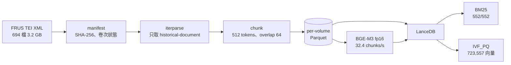
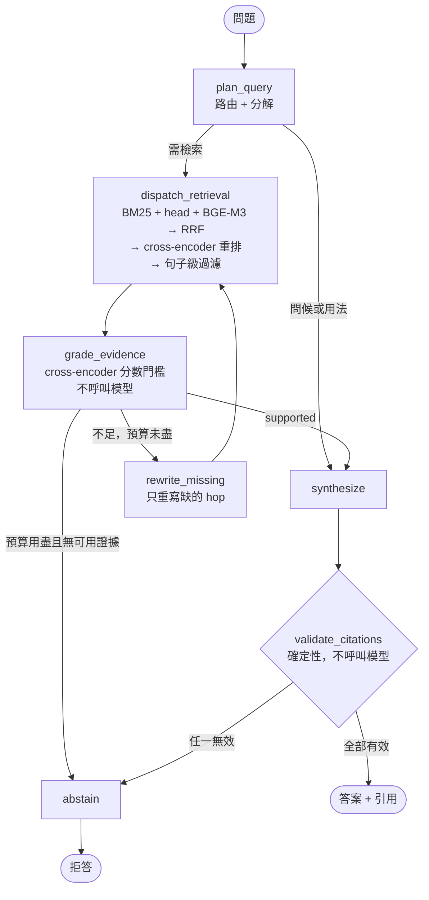

# frus-agentic-rag

於全部已出版的《美國外交關係文件集》（Foreign Relations of the United States, FRUS）上實作有界限的 agentic 檢索問答。

系統的輸出限定為兩種：引用實際存在的 FRUS 文件作答，或拒答。引用驗證由確定性程式碼執行，不經模型判斷。模型產生但未被檢索到的 evidence id、格式不合的 id、以及指向編者按語而非原始文件的 id，均視為阻斷性失敗並轉為拒答。

語料為 pinned snapshot `4b4c402f`，共 **552 個已出版卷次、306,016 份歷史文件、723,557 個 chunk**。

全部流程於單機 RTX 4060 Laptop 8GB 上執行，不呼叫外部生成服務。

---

## 主要結果

語料建置與圖的終止性已完成量測。

| 項目 | 數值 |
|---|---:|
| XML 檔 | 694 |
| 已出版卷次 / 規劃中卷次 | 552 / 142 |
| `div[@type='document']` | 314,483 |
| `historical-document`（進入證據語料） | 306,016 |
| `editorial-note`（保留，永不可引用） | 8,467 |
| Chunk（512 tokens，overlap 64） | 723,557 |
| **BM25 覆蓋率** | **552 / 552 卷** |
| **Dense 覆蓋率** | **723,557 / 723,557 chunk** |

BGE-M3 全量向量化實測 **32.4 chunks/s**（fp16、batch 16），峰值視訊記憶體 1.26 GiB，全庫 6.2 小時完成。

路由在改寫下的穩定性。10 個語意意圖，各 3 種說法，共 30 次執行：

| 指標 | LLM router | 規則式 router |
|---|---:|---:|
| 改寫一致性 | **0.80** | 0.40 |
| 路由準確率 | **0.90** | 0.80 |
| 結構化輸出有效率 | **1.00** | — |

預登記門檻為一致性 ≥ 0.80，未達則退回規則式 router。實測值為 0.80，達到門檻；規則式 router 在同一組測試上的一致性為 0.40、準確率 0.80，兩項均低於 LLM router。planner 中位延遲 3.2 秒。

### B0–B3 雙語 ablation（350 runs，已完成一輪）

35 個 gold case × 中英雙語 × 5 個系統。判定依預登記門檻，五條通過一條。

| 門檻 | 判定 |
|---|---|
| 1 multi-hop 檢索召回 +10pp | **通過**，+24.2pp（0.733 → 0.975）；但檢索預算不對等（B3 3.26 次對 B0 1.0），報告標記 `budget_confounded: true`，且同一組題的正確率下降 7.1pp |
| 2 路由 macro-F1 ≥ 0.80 | **未通過**，0.4477 |
| 3 unanswerable 不得誤答 | **未通過**，2 筆誤答 |
| 4 引用有效性 | 引用精確率 0.5456、claim 覆蓋率 1.00 |
| 5 p95 延遲 | **數據作廢**，見下 |

分階段召回顯示規劃分解有效而下游抵銷了它：multi-hop 檢索召回 0.733 → 0.975，
但經過 grader 後的接受率由 0.792 降至 0.650，正確率隨節點增加而遞減
（0.414 → 0.386 → 0.343）。配對比較中 B1、B2、B3 對 baseline 各為 +6.4pp
（勝 8、敗 1、平 51），三者檢索完全相同，差異全在下游。就本輪數據，**B1 為最佳配置**。

可回答題中有 79/300 拒答，其中 56 筆已檢索到 gold 文件。成因見
[docs/HANDOVER.md](docs/HANDOVER.md) 第 1.1 節，尚未修復。

**門檻 5 的延遲數字不可引用。** 追蹤 span 的 payload 過大（每題約 200KB），
Phoenix 的 exporter 每批逾時 10 秒：同一題 B3 在追蹤開啟時為 789 秒、關閉時為 42 秒。
payload 上限已降至十分之一，但本輪的延遲欄位包含此開銷，須待下一輪重新量測。
本輪原始結果保留於 `reports/v1-chunk-grader/`。

### 證據篩選改為確定性

本輪之後，B2/B3 的 LLM grader 已移除，改以 cross-encoder 分數過濾
（`retrieval/select.py`），LLM 呼叫上限因此由 4 降為 3。移除理由為該階段在兩個方向上
皆未依證據品質作出判斷：要求其點名保留時，受自身 schema 上限所限，
在十份的視窗中最多接受八份，實測移除 40% 的文件與其中 15 份 gold；
反轉為點名拒絕後，於所有測試執行中拒絕數均為零。

門檻參數目前未設定，因為 cross-encoder 的 logit 未經校準，且實測分佈顯示其尺度隨題型移動：
gold 文件在 lookup 題上的均值為 +3.16，在 multihop 題上為 −0.89。
以 lookup 校準的絕對門檻會清除 multihop 的全部 gold。
在 `scripts/score_distribution.py` 於完整 gold set 上執行之前，此階段保留全部證據並記錄其本應作出的決定。

---

## 方法

### 語料建置



切塊不跨文件邊界：文件為可引用的最小單位，橫跨兩份文件的 chunk 無法歸屬引用。BM25 索引先於向量建立，因此未完成的向量化仍保留可用的檢索器；`dense_search` 以 `embedded = true` 過濾，尚未向量化的 chunk 不進入排序。

### Agent 圖



檢索之後有兩個確定性階段，均不呼叫生成模型。cross-encoder 重排解決的是相似度與相關性的差異：
BM25 與 BGE-M3 皆獨立編碼查詢與段落後再比較，因此主題正確但未回答問題的段落與真正回答的段落得分相同。
每跳取 50 份候選可使 91.7% 的 gold 文件進入候選池，而 RRF 前 14 名僅承載 37.5%，
差距全部來自排序。句子級過濾接著以同一個 cross-encoder 在句子粒度上評分，
只重寫 prompt 呈現的文字（保留 63–74%），不更動檢索結果與可引用單位；
FRUS 文書照應密集，故每個保留的句子連同前後各一句一併保留。兩者在 GPU 上合計約 2–4 秒，
在 CPU 上句子過濾會自動停用並於 trace 記錄原因。

預算上限實作於條件邊，而非依賴 recursion limit：最多 3 個 subquery、2 輪檢索、1 次修正、
3 次 LLM 呼叫（grader 移除前為 4 次）。`frus graph-smoke` 以可注入的假工具驗證五條路徑，全部在上限內終止。

| 層 | 工具 | 用途 |
|---|---|---|
| 圖 | LangGraph typed StateGraph | 條件邊、SQLite checkpoint、可測試的分支 |
| 儲存與檢索 | LanceDB | 單一儲存同時提供 BM25（tantivy FTS）與向量 ANN |
| 向量 | BGE-M3 1024 維 | 離線批次用 GPU，線上查詢用 CPU |
| 生成 | Qwen3 4B instruct Q4 | 本機 Ollama，JSON schema 約束輸出 |
| 追蹤 | Arize Phoenix、OpenInference | 手寫 span，非 auto-instrumentor |
| 環境 | Docker、uv、ruff、mypy | 依賴以 `uv.lock` 鎖定 |

對模型開放的工具限於五個具 schema 的本機函式：`hybrid_search`、`lookup_document`、`timeline_search`、`get_adjacent_context`、`get_series_status`。模型不產生 SQL、檔案路徑或 URL；canonical URL 由程式組合。

---

## 為何兩條檢索臂都保留

dense 索引建立後，hybrid 檢索在 gold set 上的 recall@10 為 0.186，低於單獨使用 BM25 的 0.209。診斷結果如下。

IVF_PQ 的預設參數在 72 萬向量上掃描的分區數過少。調整為 `nprobes=400, refine_factor=20` 後，dense recall@10 由 0.070 上升至 0.116，此項調整即使融合結果回到與詞彙臂相同的水準。RRF 另改為加權形式，以避免召回較低的一臂排擠另一臂位於第 5 至 10 名的命中。

權重未經調參。在 0.0 至 1.0 區間掃描，gold set 分數的最大差異為 1 份文件（共 43 份），落在雜訊範圍內，故不以其中最高值作為結果報告。

保留向量檢索的依據來自 gold set 未涵蓋的測試。以下為不含任何英文錨點的中文查詢：

| 查詢（zh-TW，無英文錨點） | BM25 | Dense 首位命中 |
|---|---:|---|
| 美國承認共產中國的討論 | **0 筆** | Memorandum, Office of Chinese Affairs |
| 古巴飛彈危機期間的外交電報 | **0 筆** | Telegram From the Embassy in Cuba |
| 關於巴拿馬運河主權的談判 | **0 筆** | Memorandum From Secretary Rusk to President Johnson |
| 第二次世界大戰後對日本的佔領政策 | **0 筆** | Report by the State-War-Navy Coordinating Subcommittee for the Far East |
| 美蘇限制戰略武器談判 | **0 筆** | Telegram From the Delegation to the SALT |

BM25 於英文語料上對中文查詢的召回為 0，五題皆然。向量檢索為此系統雙語能力的唯一來源。

現有 gold set 無法觀測此性質：機器產生的每一題均嵌入英文標題與專有名詞，所測量者為詞彙檢索，對向量檢索構成結構性低估。三個回歸測試針對此能力設立，以避免其在詞彙指標維持正常的情況下失效。

綜合而言，此語料在英文查詢下由詞彙檢索主導，在中文查詢下則完全依賴向量檢索；現有 gold set 僅能觀測前者。

---

## 已知的評估限制

### 中文題上兩組系統拿到的查詢語言不同

planner 的 prompt 要求 subquery 一律寫成英文，所以 B1/B2/B3 收到中文問題時會先轉成英文再檢索。**B0 與 B0-2step 沒有這一步**，直接把中文丟進檢索器。兩邊在中文題上因此不是在比同一件事。

此差異的方向以下列實測確認：

| 查詢方式 | recall@10 |
|---|---:|
| 中文原句（B0 路徑） | **0.302** |
| planner 翻譯後（B1–B3 路徑） | 0.256 |
| 人工英文題 | 0.209 |

翻譯步驟在此題組上使 recall 下降，人工英文題的分數最低。成因為 gold set 的建構方式：中文題以原形嵌入英文專有名詞，構成詞彙訊號密度較高的查詢；英文題為完整句子（`What does the FRUS document titled 'X', dated Y, say?`），其中的功能詞稀釋了詞彙訊號。

此偏差的方向對 baseline 有利，因此中文題上若觀測到 B3 優於 B0，該差值為下界。此結果亦顯示 gold set 所測量者為錨點詞比對而非語言處理能力。ablation 報告分語言呈現，不將中英文合併為單一數值。

### gold cases 是機器草擬的

`eval/gold_cases.jsonl` 每筆均標註 `review_status: "unreviewed"` 與 `authored_by: "claude-generated"`，報告中重複載明。題目取自被索引的同一批語料，構成自我參照的評估：所測量的是 pipeline 能否重新檢索出自身已索引的文字，而非史學正確性。經史學專業人員覆核可移除此限制。

建構過程修正過三項缺陷，均於實際執行檢索後才顯現：

| 缺陷 | 證據 | 修法 |
|---|---|---|
| 僅給標題的 lookup 題無法指向單一文件 | `The Secretary of State to the Consulate General at Batavia` 共用於 216 個 chunk | 限定標題於全語料罕見，並將日期寫入題目 |
| multi-hop 的 gold 為卷內隨機抽樣 | recall 實測 0/30；抽樣文件與問題間無對應關係 | 改以該卷中出現於 2–4 份文件的專有名詞為錨點 |
| 錨點詞混入句首大寫的一般詞 | `Section`、`Draft`、`Presently`、`Suppose` 召回為 0；專有名詞（`Daland`、`Istrian`）則全數命中 | 僅自句中位置取大寫詞 |

### 答案正確性由外部模型評分

其餘指標均為確定性且可離線重現。answer correctness 需經模型評分，故單獨列出並標明評分者（Gemini）；無金鑰時記為 `judge: "unavailable"`，不填補估計值。評分者僅讀取已產生的答案，不提供證據，封閉語料的界線不受影響。

---

## Ollama 的 JSON schema 約束

所有交給模型的 schema 中，list 一律標註 `maxItems`，字串則不設長度上限。此約定的依據如下。

未標註 `maxItems` 時，grammar-constrained decoder 在單次 grade 呼叫上生成 14,000 個 token 直至讀取逾時。加入界限後，同一呼叫的耗時由 300 秒（逾時）降至 2.6 秒。

反之，`maxLength`、`minLength`、`minItems` 會使 Ollama 回傳 400 `failed to parse grammar`；此結果以對執行中的 server 逐項 bisect 確認。字串長度改由 `num_predict` 限制。

grader 原設有自由填寫的 `missing` 欄位，模型於其中輸出整段推理而觸及上限。該欄位已移除，其資訊由 `corrective_query` 承載，且為檢索器可直接使用的形式。

---

## 執行

需要 Docker、NVIDIA driver 與 NVIDIA Container Toolkit。

```bash
docker compose build
```

```bash
docker compose up -d ollama && docker compose exec ollama ollama pull qwen3:4b-instruct
```

`scripts/dev.sh` 以 host venv 執行同一份程式碼，免去重建 image；`docker compose run --rm dev` 則於 image 內執行。

```bash
./scripts/dev.sh frus manifest
```

```bash
./scripts/dev.sh frus ingest
```

### 建立向量索引

執行前先停止 Ollama。8 GB 視訊記憶體同時容納兩者的餘裕有限，且上述吞吐量的量測前提為 GPU 閒置。

```bash
docker compose stop ollama && FRUS_GPU=1 FRUS_EMBED_DEVICE=cuda ./scripts/dev.sh frus embed --all --resume
```

```bash
docker compose up -d ollama && ./scripts/dev.sh frus index --ann
```

逐卷 checkpoint 寫入 `data/index/embed_state.json`。中斷後重新執行同一指令會由下一個未完成的卷次接續。遇 CUDA OOM 時 batch 自動減半（16 → 8 → 4），並沿用縮小後的值。

### 提問與評估

```bash
./scripts/dev.sh frus ask "尼克森政府對中國政策如何演變？" --system B3
```

```bash
./scripts/dev.sh frus gold-build && FRUS_GPU=1 ./scripts/dev.sh frus eval --systems B0-2step,B0,B1,B2,B3
```

```bash
FRUS_GPU=1 ./scripts/dev.sh python scripts/score_distribution.py
```

```bash
./scripts/dev.sh frus route-stability
```

**`FRUS_GPU=1` 不可省略。** 未設定時容器不掛載 GPU，cross-encoder 落至 CPU，
同一批 50 對的耗時由 1.0 秒變為 62.6 秒；句子過濾的 pair 數為重排的 6–15 倍，
故其在 CPU 上會自行停用並於 trace 記錄原因。`frus eval` 於開跑前列印實際裝置與
`sentence focus` 狀態，該三行為執行前的檢查點。

`scripts/score_distribution.py` 僅執行檢索，不呼叫生成模型，數十秒完成，
輸出每份候選段落的 cross-encoder 原始分數、排名與 gold 標記，
按語言與題型分層，為設定 `FRUS_SCORE_KEEP_ABSOLUTE` 與 `FRUS_SCORE_KEEP_MARGIN` 的依據。

ablation 逐筆 checkpoint 至 `reports/ablation_runs.jsonl`，支援 `--resume`。每筆記錄執行當時的檢索器模式；resume 時模式不符者予以丟棄並重跑，以避免 BM25-only 與 hybrid 的結果被合併計算。

### 服務與追蹤

```bash
docker compose up -d api ui
```

API <http://localhost:8010/docs>，Streamlit <http://localhost:8511>。

```bash
docker compose -f Phoenix/compose.yaml up -d
```

Phoenix <http://localhost:6006>。client 設定放在 repo 根目錄的 `.env`（`PHOENIX_COLLECTOR_ENDPOINT`、`PHOENIX_PROJECT`），`Phoenix/.env` 只設定 server。不設 endpoint 則追蹤退化為 no-op。

LLM 呼叫以 httpx 直接送往 Ollama，而非經由 LangChain chat model，因此不在任何 auto-instrumentor 的涵蓋範圍內。span 依 OpenInference 語意慣例手寫，使 Phoenix 得以呈現含 prompt、token 數與 schema 有效性的 LLM span，以及含檢索結果的 RETRIEVER span。

### 開發

```bash
docker compose run --rm dev uv run ruff check . && docker compose run --rm dev uv run mypy src && docker compose run --rm dev uv run pytest -q
```

```bash
docker compose run --rm dev uv run frus graph-smoke
```

---

## 專案結構

四個套件，各對應 pipeline 的一個階段。`models.py` 置於頂層，其型別為各階段共用。

```text
src/frus_agentic_rag/
  config.py       路徑、預算、檢索與生成參數
  models.py       跨層共用型別、canonical URL 組合
  cli.py          frus 指令
  api.py          FastAPI
  ui.py           Streamlit trace 檢視器
  observability.py  Phoenix / OpenInference span
  corpus/
    manifest.py   掃描 pinned snapshot，SHA-256 與卷次狀態
    tei.py        streaming TEI parser
    chunk.py      以 BGE-M3 tokenizer 切窗，字元位移還原原文
    index.py      Parquet → LanceDB → BM25 / ANN
    embed.py      BGE-M3 向量化，逐卷 checkpoint
  retrieval/
    hybrid.py     BM25 + head + dense + 加權 RRF
    rerank.py     cross-encoder 重排，載入上鎖，CPU/GPU 自動判定
    focus.py      句子級過濾，只改 prompt 呈現的文字
    select.py     以 cross-encoder 分數確定性篩選證據
    tools.py      五個具 schema 的工具
  agent/
    state.py      AgentState、預算計算、trace
    schemas.py    planner / grader / synthesizer 的結構化輸出契約
    prompts.py    提示詞
    nodes.py      各節點
    edges.py      條件邊與預算判定
    graph.py      B0–B3 的圖組裝
    run.py        入口，含 2-step baseline
    llm.py        Ollama，JSON schema 約束
    citations.py  確定性引用閘門
    fakes.py      可注入的假工具
    smoke.py      walking skeleton
  evaluation/
    gold.py       從語料草擬 gold cases
    ablation.py   B0–B3 雙語 ablation
    route.py      路由穩定性
    judge.py      外部評分者
tests/            五個扁平測試模組，需索引者自動 skip
docs/             SPEC.md、DECISIONS.md、STATE.md、HANDOVER.md
eval/             gold_cases.jsonl
reports/          corpus_stats、benchmark、graph_smoke、route_stability、
                  agent_ablation、score_distribution、v1-chunk-grader/（前一輪存檔）
```

`Phoenix/` 保留為目錄：`docker compose -f Phoenix/compose.yaml` 以其為專案目錄，並讀取 `Phoenix/.env` 進行變數替換。

---

## 基底映像

`Dockerfile` 以 `jobshift:latest` 為基底，該映像已含 Python 3.12、uv、Torch 與 Sentence Transformers。此為 layer 重用而非依賴關係：本專案不使用該映像的程式碼或資料，BGE-M3 快取為唯讀掛載，替換為任何含 CUDA Torch 的 Python 3.12 映像僅需修改一行。

`/app` 於複製本專案前清空。基底映像自帶的原始碼若保留，將成為本專案工作目錄的一部分；`ruff format --check .` 曾因此檢查 11 個非本專案檔案並回報未格式化。

Torch 解析為 PyPI 的 `2.13.0+cu130`，而非規格指定的 cu124 index：torch 為 sentence-transformers 的傳遞依賴，而 `[tool.uv.sources]` 僅綁定直接依賴。host driver 回報 CUDA 13.3，與 cu130 相符，於 RTX 4060 上實測可用。

---

## 限制

- 已完成一輪 350 runs 的 ablation，五條預登記門檻通過一條；就該輪數據，
  B1 為最佳配置，B2/B3 的額外節點降低正確率而未提升召回。
- 該輪的 p95 延遲數字因追蹤開銷而作廢，須待下一輪重新量測。
- 證據篩選的門檻參數尚未設定，此階段目前保留全部證據；B3 的糾正迴圈依賴該門檻，
  在其設定前 B3 的行為等同 B2。
- 可回答題中約 26% 拒答，其中多數已檢索到 gold 文件，成因為 evidence id 抄寫失敗，
  中文題受影響程度為英文題的三倍。詳見 [docs/HANDOVER.md](docs/HANDOVER.md)。
- gold cases 為機器草擬且未經史學專業覆核，適用範圍為回歸訊號，不構成史學正確性的外部評估。
- gold set 結構性偏向詞彙檢索，無法對向量臂作對等評估；中文能力目前僅有質性證據與回歸測試，尚無量化分數。
- 中文題的 ablation 含查詢語言差異，其數值不宜單獨解讀。
- 不實作網路檢索。FRUS 無法涵蓋的問題一律拒答，不以網路內容替代史料。
- 規劃中但未出版的 142 個卷次僅存在於 manifest，內容不可檢索；涉及該範圍的問題應得到拒答。
- 語料固定於單一 commit，官方後續修訂不會自動反映。

## 授權與使用

程式碼供個人研究與作品展示。FRUS 為美國國務院歷史文獻辦公室之公開出版品；本專案不重新散布原始 XML。
