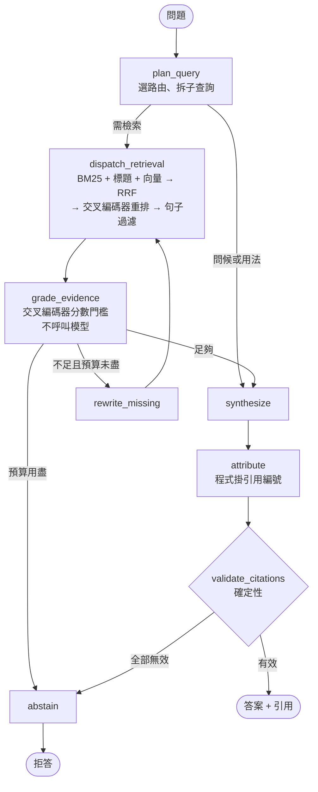

# frus-agentic-rag

在全部已出版的《美國外交關係文件集》（Foreign Relations of the United States）上問問題，
得到**引用實際文件的答案，或一句拒答**。

沒有第三種輸出。不查網路，不從模型記憶回答。引用由程式驗證——模型寫得出來的編號
如果不在檢索結果裡，那個答案不會出去。

全部在單機跑，8GB 顯卡，不呼叫外部生成服務。

**552 卷 · 306,016 份文件 · 723,557 個片段**，固定在 snapshot `4b4c402f`。

---

## 啟動

需要 Docker、NVIDIA driver 與 NVIDIA Container Toolkit。

**一、把 Ollama 叫起來**（它是獨立的 compose 專案，多個專案共用）

```bash
docker volume create ollama-models
docker compose -f Ollama/compose.yaml up -d
docker compose -f Ollama/compose.yaml exec ollama ollama pull qwen3:4b-instruct
```

**二、建映像檔**

```bash
docker compose build
```

**三、開聊天介面**

```bash
FRUS_GPU=1 ./scripts/dev.sh frus chat-ui
```

瀏覽器開 <http://127.0.0.1:7860>。

`FRUS_GPU=1` 不能省——少了它容器看不到 CUDA，交叉編碼器會掉到 CPU，
同一批重排從 1 秒變成 62 秒。

### 先確認語料在

```bash
./scripts/dev.sh frus stats
```

應該看到 723,557 個片段、723,557 個已嵌入。如果是 0，語料還沒建：

```bash
./scripts/dev.sh frus manifest && ./scripts/dev.sh frus ingest
docker compose -f Ollama/compose.yaml stop        # 8GB 卡容不下兩個
FRUS_GPU=1 FRUS_EMBED_DEVICE=cuda ./scripts/dev.sh frus embed --all --resume
docker compose -f Ollama/compose.yaml start
./scripts/dev.sh frus index --ann
```

嵌入全庫約 6.2 小時（實測 32.4 片/秒），逐卷 checkpoint，中斷後同一條指令接續。

---

## 它怎麼運作



三個設計決定值得說明，因為它們都是撞牆之後才長成這樣的：

**引用編號由程式產生，不由模型寫。** 讓模型逐字抄 chunk id 時，中文問題有 40.7% 拒答、
英文 12.0%——那不是回答能力，是抄寫失敗。現在模型只寫主張，交叉編碼器把主張對回段落，
程式掛編號。模型不可能引用到沒檢索到的東西，因為它根本不指名任何東西。

**證據篩選是確定性的，不是再叫一次模型。** 原本有個 LLM 評審挑證據，它砍掉 40% 的文件、
連帶 15 份標準答案；反轉成「點名要丟的」之後它一片都不丟。改用交叉編碼器分數之後，
篩選階段幾乎零損失，而且省下一次模型呼叫。

**預算是硬上限，寫在條件邊上。** 最多 3 個子查詢、2 輪檢索、1 次修正、4 次模型呼叫。
不靠 recursion limit 兜底。

| 層 | 用什麼 |
|---|---|
| 圖 | LangGraph typed StateGraph |
| 儲存與檢索 | LanceDB（BM25 與向量共用一個儲存） |
| 向量 | BGE-M3，1024 維 |
| 重排 | bge-reranker-v2-m3 交叉編碼器 |
| 生成 | Qwen3 4B instruct Q4，本機 Ollama，JSON schema 約束 |
| 前端 | Gradio |

模型只看得到五個有 schema 的本機函式：`hybrid_search`、`lookup_document`、
`timeline_search`、`get_adjacent_context`、`get_series_status`。
它不產生 SQL、檔案路徑或網址——canonical URL 由程式組。

---

## 現在做得到什麼、做不到什麼

**做得到**（構造式題目量測，標準答案來自 TEI 中繼資料查表，不是機器猜的）：

| | |
|---|---|
| 精確查詢（標題＋日期指定文件） | hit@1 **0.95** |
| 中文提問（完全沒有英文錨點） | 與英文**相同** 0.833 |
| 帶日期範圍的編年查詢 | 召回 **1.00** |
| 加入無關證據到 16 片 | 分數幾乎不動 |

**做不到**：

| | |
|---|---|
| 把證據抽掉時閉嘴 | 12 次答了 5 次——**會編** |
| 跨文件追蹤誰說了什麼 | 換證據順序，人物集合只有 0.333 保持一致 |
| 指出問題的前提有誤 | 0/4 |
| 走到文件的交叉引用 | 0/16——那些連結只存在於註腳，而註腳沒進索引 |

前兩項是這個系統最實在的限制。完整說明在 [docs/HANDOVER.md](docs/HANDOVER.md)。

**一句話**：它擅長「把某份文件找出來並如實轉述」，不擅長「跨好幾份文件推論」。

---

## 專案結構

```text
src/frus_agentic_rag/
  corpus/     TEI 解析、切塊、索引、嵌入
  retrieval/  混合檢索、重排、句子過濾、證據篩選
  agent/      圖、節點、提示詞、引用閘門、歸因
  evaluation/ 消融、gold 產生、外部評分
  chat_ui.py  Gradio 前端
scripts/      dev.sh（容器執行器）、探針、診斷、GCP 執行器
eval/probes/  九族探針的題目，多數為構造式
docs/         SPEC、DECISIONS、REPORT、HANDOVER、EVAL_DESIGN
archive/      過去所有實驗的原始紀錄（壓縮）
```

`Phoenix/` 與 `Ollama/` 各是獨立的 compose 專案，不屬於這個專案的服務。

---

## 想接著做的話

從 [docs/HANDOVER.md](docs/HANDOVER.md) 開始——它記的是**還沒解決的事**，
以及每件事目前量到什麼。

[docs/REPORT.md](docs/REPORT.md) 是完整的實驗紀錄：做過什麼、變因是什麼、
以及**哪些數字不能用**（有三輪的正確率作廢了，理由寫在第 1 節）。

[docs/EVAL_DESIGN.md](docs/EVAL_DESIGN.md) 是評估的設計原理——為什麼九族探針裡
有七族刻意不經過評分模型。

想重跑量測：

```bash
FRUS_GPU=1 ./scripts/dev.sh python scripts/run_probes.py all
```

約 35 分鐘，只有兩族需要外部評分模型（設 `DEEPSEEK_API_KEY` 或 `GEMINI_API_KEY`）。

---

## 限制

- 標準題目集是機器產生、未經史學專業覆核的。探針改用構造式與專家導出的標準答案，
  但整體題目集尚未替換。
- 引用代表**出處**，不代表**驗證**——沒有機制檢查那一段是否真的支持那句話。
- 不做網路檢索。FRUS 涵蓋不到的問題一律拒答。
- 規劃中但未出版的 142 卷只存在於 manifest，內容不可檢索。
- 語料固定在單一 commit，官方後續修訂不會反映。

## 授權與使用

程式碼供個人研究與作品展示。FRUS 為美國國務院歷史文獻辦公室之公開出版品；
本專案不重新散布原始 XML。
