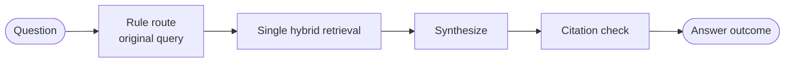
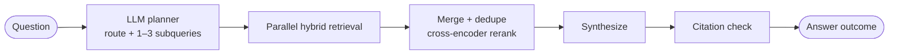
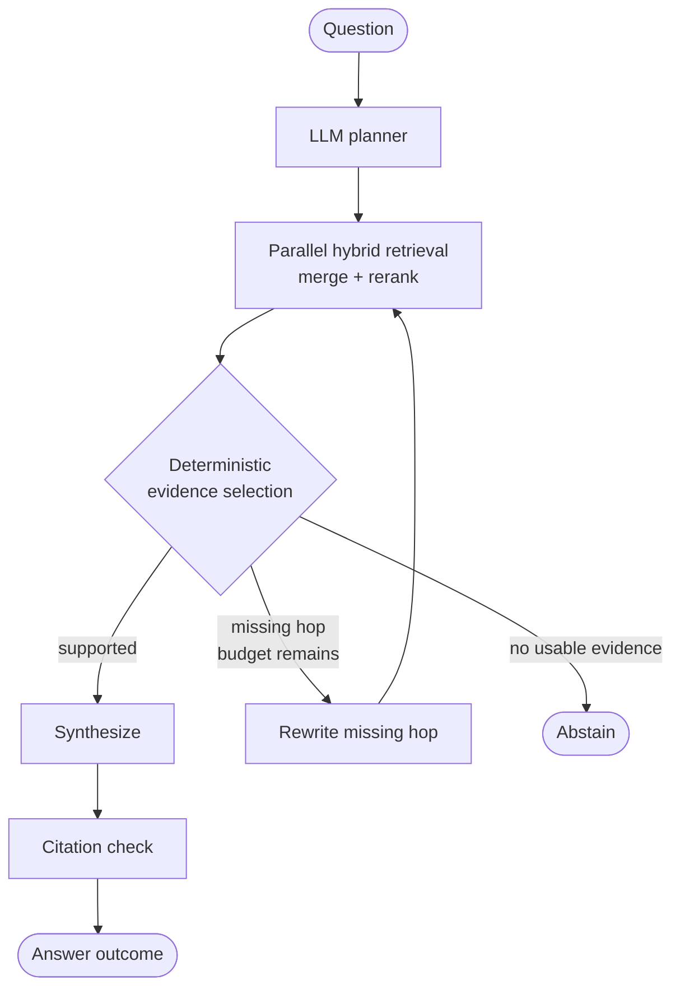
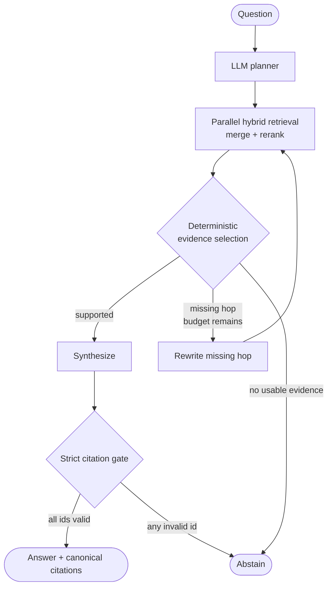
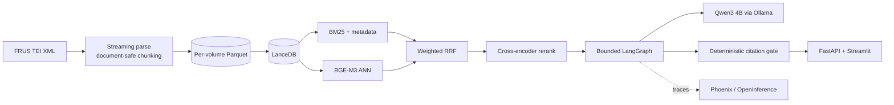

# FRUS Strategy Lab — Evaluation-driven Agentic RAG

> 在 30 萬份外交史料上，測試哪些 RAG 元件真的值得它增加的成本。

我做這個專案，不是為了把 LangGraph 接到搜尋框上就稱為 Agentic RAG，而是想回答一個更具體的工程問題：在封閉語料、單張 RTX 4060 8GB 與本機小模型的限制下，query planning、multi-query retrieval、evidence selection、corrective retrieval 與 citation gate，哪些真的能改善結果？

目前專案處於**評估與收斂階段**。全量 FRUS 語料、混合檢索、B0–B3 graph、服務介面與追蹤都已完成；第一輪 350-run 消融實驗也已跑完。初步結果顯示 query planning 能提高 multi-hop 證據覆蓋，但更複雜的下游節點反而抵銷了增益。下一輪將用對等檢索預算與獨立的 R0–R3 實驗，確認增益究竟來自規劃品質，還是單純來自更多次搜尋。

## Project snapshot

| 項目 | 現況 |
|---|---|
| Corpus | 552 個已出版卷次、306,016 份歷史文件 |
| Index | 723,557 chunks；BM25、BGE-M3 dense、cross-encoder rerank |
| Generation | Qwen3 4B Instruct Q4，透過本機 Ollama 執行 |
| Orchestration | LangGraph typed StateGraph，具明確預算與終止條件 |
| Evaluation | 35 cases × 中英雙語 × 5 systems = 350 runs |
| Hardware | RTX 4060 Laptop 8GB；全量 BGE-M3 embedding 已完成 |
| Current phase | B 系列 v1 完成；selector、citation protocol 與 R 系列實驗進行中 |

語料固定於 FRUS source commit `4b4c402f0cce25144ded2198ba9566b6c37c7c49`。線上回答只允許兩種結果：引用實際檢索到的 FRUS 文件，或明確拒答。正式問答路徑不使用網路搜尋，也不讓模型自行產生 URL。

## 我想驗證什麼

Agentic RAG 很容易「看起來更聰明」，卻同時增加延遲、模型呼叫與失敗面。這個專案把問題拆成四個可反駁的假設：

1. LLM planner 是否比單次原始查詢找到更多 multi-hop 證據？
2. Evidence selection 是否真的移除雜訊，而不是誤刪正確文件？
3. Corrective retrieval 是否能補回缺失 hop，而不是重複搜尋同一批內容？
4. Strict citation gate 是否能降低錯誤引用，且不造成過量拒答？

因此 B0–B3 不是產品版本號，而是一組逐步加入能力的消融實驗。固定 2-step pipeline 另保留為 control，避免 graph wiring 改變後失去比較基準。

## B0–B3：Agent graph 消融

| 系統 | 新增策略 | 要回答的問題 |
|---|---|---|
| B0 | 規則路由、單一原始查詢 | 最小 graph 能做到什麼？ |
| B1 | LLM route + query decomposition | 多 query 規劃是否提高證據覆蓋？ |
| B2 | Deterministic evidence selection + bounded correction | 篩選與一次修正能否補回缺失 hop？ |
| B3 | Blocking citation gate | 嚴格引用治理是否值得額外拒答？ |

所有 graph 都受同一組硬限制：約束最多 3 個 subquery、2 輪檢索、1 次 correction 與 3 次 LLM call。預算檢查寫在 conditional edges，而不是期待模型自己停止。

### B0 — Rule-routed single retrieval

B0 不呼叫 LLM planner。它保留原始問題，以規則選擇 lookup、timeline、status 或一般 hybrid search，檢索一次後直接合成。



### B1 — Planned multi-query retrieval

B1 加入 LLM planner，將問題轉成 1–3 個英文 subquery，平行檢索後合併、去重並重排；不做 evidence selection，也不啟動 correction loop。



### B2 — Evidence selection with one correction

B2 在 B1 後加入確定性分數篩選。若某個 hop 缺乏足夠證據，graph 最多改寫並重搜一次；預算用盡後只能用已接受證據作答或拒答。



目前 selector 的 score threshold 尚未校準，因此 current default 是 keep-all；在門檻設定前，B2 的 correction edge 雖然存在，卻不應被宣稱為已驗證有效。

### B3 — Strict citation governance

B3 使用與 B2 相同的規劃、檢索與修正路徑，差別在最後一個確定性閘門：任何不存在、未檢索到或不符合 canonical FRUS 格式的 evidence id，都會阻止答案輸出。



這個 gate 驗證的是 provenance，不是語義正確性；「引用存在」不等於「引用足以回答問題」。Unanswerable detection 仍需獨立測試。

## 第一輪實驗：目前知道什麼

以下為 v1 的確定性 pipeline 指標。該輪 B2/B3 仍使用後來證實會誤刪 gold 的 LLM grader；目前程式已改成 deterministic selector，但尚未完成新一輪 ablation。Gold cases 是從同一語料機器草擬、尚未經史學專家覆核，因此適合作為 regression signal，不應包裝成外部歷史問答 benchmark。

| System | Agent union recall | Multi-hop union recall | Citation recall | Mean retrieval calls |
|---|---:|---:|---:|---:|
| B0 | 0.728 | 0.733 | **0.564** | **1.00** |
| B1 | **0.792** | **0.975** | 0.506 | 1.80 |
| B2 | 0.792 | 0.975 | 0.444 | 3.20 |
| B3 | 0.792 | 0.975 | 0.458 | 3.26 |

### v1 reproducibility anchors

| Artifact | Pinned value |
|---|---|
| Agent/retrieval code and prompts | `66a03d2cc93c6e83ff4288dcf7d315a608187ff5` |
| FRUS source snapshot | `4b4c402f0cce25144ded2198ba9566b6c37c7c49` |
| Evaluation set | `eval/gold_cases.jsonl`, SHA-256 `d0bc30bf0a819448a924b2d8ee0cbf31174d83092c7ca0d1e9943bfab4e57102` |
| Generator | `qwen3:4b-instruct` via Ollama；temperature `0.0` |
| Auxiliary judge | `gemini-3.5-flash-lite`；只作探索性分析，不作唯一品質證據 |
| Full parameters and raw results | `reports/v1-chunk-grader/agent_ablation.json`、`ablation_runs.jsonl` |

這輪結果支持三個暫時結論：

- **VERIFIED — Planning 找到更多 multi-hop gold documents。** B1 的 multi-hop union recall 比 B0 高 24.2pp。
- **UNVERIFIED — 增益是否來自更好的規劃。** B1 使用 1.8 次檢索、B0 只有 1 次；下一輪必須對齊 retrieval budget 才能做因果歸因。
- **REFUTED — 節點越多，答案就越好。** B2/B3 沒有增加 retrieval recall，反而在 evidence selection 與 citation 階段丟失更多 gold；就 v1 而言，B1 是較合理的最小組裝。

舊報告中的 p95 latency 不採用。Phoenix 曾將過大的 span payload 傳到 exporter，單次 timeout 被算入回答時間；payload 已縮小，但必須在乾淨條件下重跑後才能報告延遲。

完整原始輸出與摘要均保留於 `reports/v1-chunk-grader/`。

## 失敗實驗如何改變設計

| 實驗 | 實際觀察 | 工程決策 |
|---|---|---|
| LLM grader 點名保留證據 | 受 schema/window 限制，誤刪 gold | Runtime grader 改為 cross-encoder 分數的確定性 selector |
| LLM grader 點名拒絕證據 | 所有測試都拒絕 0 份，節點空轉 | 不再用生成模型做 passage selection |
| Planner 直接輸出 volume id | 小模型會捏造不存在的 id，使搜尋靜默回傳空集合 | 所有 filter 先經 manifest resolve；無結果時放寬 filter 重搜 |
| Phoenix 完整保存 prompt 與 passage | Export timeout 將延遲放大 4–19 倍 | Trace 改存摘要與上限，延遲實驗全部重跑 |
| 中文答案複製長 chunk id | 中文拒答顯著高於英文，即使 gold 已被檢索到 | 下一版改測短序號 citation protocol |

對我而言，這些失敗比一個漂亮但無法歸因的總分更重要：每次修改都由 trace 或配對實驗觸發，而不是看到低分後直接增加另一個 Agent。

## 現在正在做什麼

### 1. 校準 evidence selector

先在全部 35 cases 上取得 cross-encoder 分數分佈，再比較三種策略：

| Variant | 策略 |
|---|---|
| A | 固定 top-k，作為最簡單 baseline |
| B | min-k + relative score margin |
| C | min-k + margin + max-k |

選擇標準不是「留下越少越好」，而是 gold recall、context tokens、synthesis latency 與最後 citation recall 的聯合結果。如果 B/C 無法相對 A 保留更多有效證據或明顯降低成本，就保留固定 top-k。

### 2. 修正 citation protocol

目前 evidence id 是長字串，例如 `frus1969-76v17p1:d12:3`。下一輪將比較：

- 模型直接複製完整 id
- prompt 內使用短序號 `[1]`、`[2]`，由程式映射回 canonical id

驗收重點是中文 answer success、錯誤映射數與 citation recall，而不是只看格式通過率。

### 3. 新增 R0–R3 retrieval-stage ablation

B 系列只回答 Agent graph 是否值得；它無法隔離目前所有系統共用的 retrieval post-processing。下一輪新增獨立 R 系列：

```text
R0  hybrid retrieval
R1  + cross-encoder rerank
R2  + deterministic evidence selection
R3  + sentence-level context focus
```

這組實驗會回答 rerank、selection 與 sentence focus 各自帶來多少 recall、token 與 latency 變化，避免把檢索工程的收益錯算成 Agent 收益。

## 下一輪實驗矩陣

| 實驗 | 對照 | 核心指標 | 改判條件 |
|---|---|---|---|
| Budget-matched planning | B0 vs B1，同 retrieval calls / candidates | paired multi-hop union recall | 對齊預算後仍提升 ≥10pp，才保留 LLM planning |
| Selector strategy | A vs B vs C | gold recall、context tokens、citation recall | 複雜 selector 無明顯收益就退回固定 top-k |
| Citation protocol | full id vs short id | zh/en answer success、invalid mappings | 短 id 降低拒答且不產生錯誤映射才採用 |
| Retrieval stages | R0 → R3 | recall、rerank gain、synthesis latency | 每個階段都必須證明自己的增量價值 |
| Clean latency | tracing off/on control | p50/p95、B3:B0 ratio | B3 p95 不得超過 B0 2.5 倍 |
| Unanswerable control | answerable vs out-of-scope cases | false-answer count、abstention recall | false answer 必須降為 0 |
| Eval v2 | 現有 synthetic vs reviewed cases | per-kind recall、joint-hop success | 補 timeline、真正 vocabulary mismatch 與人工覆核 |

## System architecture



| Layer | Choice | Why |
|---|---|---|
| Corpus | TEI XML → Parquet | 逐卷 checkpoint，可中斷重跑，不跨文件切 chunk |
| Store | LanceDB | 同一份資料提供 FTS、metadata filter 與 ANN |
| Retrieval | BM25 + BGE-M3 + weighted RRF | 英文精確詞由 lexical 主導，中文與改寫由 dense 補足 |
| Rerank | Cross-encoder | 將「主題相似」與「真的回答問題」分開 |
| Agent | LangGraph | 明確 state、conditional edges、可測試終止路徑 |
| LLM | Qwen3 4B Instruct Q4 | 8GB VRAM 可本機執行，Pydantic JSON schema 約束輸出 |
| Safety | Deterministic citations | URL 與 evidence id 由程式驗證，不交給模型裁決 |
| Observability | Phoenix + OpenInference | 追蹤 route、subquery、retrieval、tokens 與節點延遲 |

## Local-first constraints

正式問答的 embedding、planning 與 generation 全部在本機執行；可選的外部 LLM judge 只用於實驗分析，不參與線上答案，也不應作為唯一品質證據。

BGE-M3 全量向量化在 RTX 4060 Laptop 上實測：

| Metric | Result |
|---|---:|
| Throughput | 32.4 chunks/s |
| Peak VRAM | 1.26 GiB |
| Full corpus | 約 6.2 小時 |

離線 embedding 與 Ollama 分時使用 GPU；線上服務由 Ollama 使用 GPU，query embedding 使用 CPU，避免 8GB VRAM 同時載入兩個模型。

## Run locally

需要 WSL2、Docker、NVIDIA driver 與 NVIDIA Container Toolkit。Python 依賴由 `pyproject.toml`、`uv.lock` 與專案 `.venv` 管理。

### 1. Build and start Ollama

```bash
docker compose build
docker compose up -d ollama
docker compose exec ollama ollama pull qwen3:4b-instruct
```

### 2. Build the corpus and indexes

```bash
./scripts/dev.sh frus manifest
./scripts/dev.sh frus ingest
```

執行全量 embedding 前先停止 Ollama：

```bash
docker compose stop ollama
FRUS_GPU=1 FRUS_EMBED_DEVICE=cuda ./scripts/dev.sh frus embed --all --resume
docker compose up -d ollama
./scripts/dev.sh frus index --ann
```

Embedding 以逐卷 checkpoint 執行，中斷後重跑同一指令即可續跑；CUDA OOM 時 batch 會自動由 16 降至 8、4。

### 3. Ask a question

```bash
./scripts/dev.sh frus ask "尼克森政府對中國政策如何演變？" --system B3
```

### 4. Run evaluation

```bash
FRUS_GPU=1 ./scripts/dev.sh frus eval --systems B0-2step,B0,B1,B2,B3
FRUS_GPU=1 ./scripts/dev.sh python scripts/score_distribution.py
./scripts/dev.sh frus route-stability
```

### 5. Start API, UI and tracing

```bash
docker compose up -d api ui
docker compose -f Phoenix/compose.yaml up -d
```

- FastAPI: <http://localhost:8010/docs>
- Streamlit: <http://localhost:8511>
- Phoenix: <http://localhost:6006>

### 6. Quality checks and shutdown

```bash
docker compose run --rm dev uv run ruff check .
docker compose run --rm dev uv run mypy src
docker compose run --rm dev uv run pytest -q
docker compose run --rm dev uv run frus graph-smoke
```

```bash
docker compose -f Phoenix/compose.yaml down
docker compose down
```

## Repository map

```text
src/frus_agentic_rag/
  corpus/       TEI parsing, chunking, manifest, embedding, index
  retrieval/    hybrid search, rerank, sentence focus, evidence selection, tools
  agent/        state, schemas, nodes, conditional edges, graph, citations
  evaluation/   gold cases, B-series ablation, route tests, optional judge
  api.py        FastAPI entry point
  ui.py         Streamlit trace viewer
scripts/        fixed experiments and diagnostics
eval/           versioned evaluation cases
reports/        raw runs, summaries and graph artifacts
docs/           current state, decisions and active handover
```

## Current limitations

- Gold cases 為 machine-drafted、unreviewed，只能支援回歸與工程比較，不能代表史學正確性。
- v1 的 B0/B1 retrieval budget 不對等，因此 planning gain 尚未完成因果驗證。
- Selector threshold 尚未校準；在設定前，B2/B3 correction loop 不代表有效的 corrective retrieval。
- 中文生成較常抄錯長 evidence id；短序號 citation protocol 尚在測試。
- 最新 `graph-smoke` 的所有路徑都能在預算內終止，但 unanswerable case 仍錯誤作答，整體 `pass=false`。
- 現有題庫缺少 timeline、高扇出 multi-hop 與真正 vocabulary-mismatch case。
- 舊 latency 報告含 tracing exporter 開銷，乾淨的 p95 尚待重跑。
- 系統不做 web fallback；FRUS 範圍以外或尚未出版的內容一律拒答。

## Why this is still in progress

目前最有價值的結果不是「B3 贏了」，而是已經能清楚指出每個增益與損失發生在哪一層。這個 repository 保留失敗實驗、原始評測與預先定義的退場條件，目標是最後選出**最小、可驗證、在本機硬體上可維運**的 RAG 組裝，而不是替最複雜的 graph 找一個漂亮分數。

## License and data

程式碼供個人研究與作品展示。FRUS 為美國國務院歷史文獻辦公室公開出版品；本專案固定來源版本並建立本機索引，不重新散布原始 XML。
