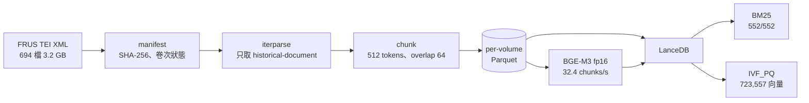
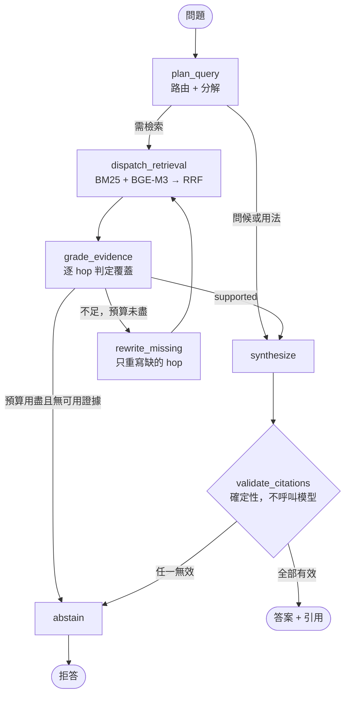

# frus-agentic-rag

在全部已出版的《美國外交關係文件集》（Foreign Relations of the United States, FRUS）上做有界限的 agentic 檢索問答。

一般 RAG 的失敗方式是回答得很流暢但無法驗證。本專案的設計前提相反：**答案要嘛引用得出真實存在的 FRUS 文件，要嘛拒答**。引用驗證是確定性程式碼，不經模型；模型憑空產生的 evidence id、沒被檢索到的 id、指向編者按語而非原始文件的 id，一律視為阻斷性失敗。

語料為 pinned snapshot `4b4c402f`，共 **552 個已出版卷次、306,016 份歷史文件、723,557 個 chunk**。

全部在單機 RTX 4060 Laptop 8GB 上執行，不呼叫任何外部生成服務。

---

## 主要結果

語料建置與圖的終止性已完成實測。

| 項目 | 數值 |
|---|---:|
| XML 檔 | 694 |
| 已出版卷次 / 規劃中卷次 | 552 / 142 |
| `div[@type='document']` | 314,483 |
| `historical-document`（進入證據語料） | 306,016 |
| `editorial-note`（保留，永不可引用） | 8,467 |
| Chunk（512 tokens，overlap 64） | 723,557 |
| **BM25 覆蓋率** | **552 / 552 卷** |
| **Dense 覆蓋率** | **723,557 / 723,557 chunk** |

BGE-M3 全量向量化實測 **32.4 chunks/s**（fp16、batch 16），峰值視訊記憶體 1.26 GiB，全庫 6.2 小時完成。

路由在改寫下的穩定性，10 個語意意圖各 3 種說法，共 30 次：

| 指標 | LLM router | 規則式 router |
|---|---:|---:|
| 改寫一致性 | **0.80** | 0.40 |
| 路由準確率 | **0.90** | 0.80 |
| 結構化輸出有效率 | **1.00** | — |

預登記門檻要求一致性 ≥ 0.80，未達則退回規則式 router。實測剛好 0.80 通過，而**退路本身在這個語料上更差**，所以 LLM router 是憑證據留下的。planner 中位延遲 3.2 秒。

**尚未有數字的部分：agentic 相對 2-step baseline 的品質增益。** B0–B3 的雙語 ablation 仍在執行，在 `reports/agent_ablation.json` 產出之前，本文件不宣稱 agentic 有提升。

---

## 方法

### 語料建置



不跨文件切塊。文件是可引用的最小單位，橫跨兩份文件的 chunk 無法歸屬。BM25 在任何向量存在之前就先建好，因此半途中斷的向量化仍留下可用的檢索器；`dense_search` 以 `embedded = true` 過濾，未向量化的 chunk 不會混入排序成為雜訊。

### Agent 圖



上限寫在邊上，不靠 recursion limit 兜底：**最多 3 個 subquery、2 輪檢索、1 次修正、4 次 LLM 呼叫**。這四個數字由 `frus graph-smoke` 在假工具上驗證，五條路徑全部在預算內終止。

| 層 | 工具 | 用途 |
|---|---|---|
| 圖 | LangGraph typed StateGraph | 條件邊、SQLite checkpoint、可測試的分支 |
| 儲存與檢索 | LanceDB | 單一儲存同時提供 BM25（tantivy FTS）與向量 ANN |
| 向量 | BGE-M3 1024 維 | 離線批次用 GPU，線上查詢用 CPU |
| 生成 | Qwen3 4B instruct Q4 | 本機 Ollama，JSON schema 約束輸出 |
| 追蹤 | Arize Phoenix、OpenInference | 手寫 span，非 auto-instrumentor |
| 環境 | Docker、uv、ruff、mypy | 依賴以 `uv.lock` 鎖定 |

只開放五個具 schema 的本機工具：`hybrid_search`、`lookup_document`、`timeline_search`、`get_adjacent_context`、`get_series_status`。模型不產生 SQL、檔案路徑或任何 URL —— canonical URL 一律由程式組合。

---

## 為何兩條檢索臂都保留

dense 索引建好後，hybrid 檢索在 gold set 上**低於單獨 BM25**：0.186 對 0.209。查下來有兩件事。

IVF_PQ 的預設在 72 萬向量上掃描的分區太少。調到 `nprobes=400, refine_factor=20` 後 dense recall@10 由 0.070 升到 0.116，光這一項就讓融合回到與詞彙臂持平。RRF 改為加權，避免弱臂把強臂的命中擠出前 10。

**權重沒有調參。** 從 0.0 掃到 1.0，gold set 分數最多只差 1 份文件（共 43 份），那是雜訊；挑其中最高的來宣稱有增益是在擬合雜訊。

dense 之所以保留，靠的是 gold set 產不出的證據。純中文、不含任何英文錨點的問句：

| 查詢（zh-TW，無英文錨點） | BM25 | Dense 首位命中 |
|---|---:|---|
| 美國承認共產中國的討論 | **0 筆** | Memorandum, Office of Chinese Affairs |
| 古巴飛彈危機期間的外交電報 | **0 筆** | Telegram From the Embassy in Cuba |
| 關於巴拿馬運河主權的談判 | **0 筆** | Memorandum From Secretary Rusk to President Johnson |
| 第二次世界大戰後對日本的佔領政策 | **0 筆** | Report by the State-War-Navy Coordinating Subcommittee for the Far East |
| 美蘇限制戰略武器談判 | **0 筆** | Telegram From the Delegation to the SALT |

BM25 在英文語料上遇到中文查詢，每一次都回 0 筆。這就是整個雙語能力的來源。

**而 gold set 看不到這件事** —— 機器產生的每一題都嵌了英文標題與專有名詞，因此那組題目量的是詞彙檢索，結構性地低估 dense。三個回歸測試把這個能力釘住，否則它可能在所有詞彙指標都是綠燈的情況下悄悄消失。

誠實的結論是：**這個語料對英文問題偏好詞彙檢索，對中文問題則必須靠向量檢索，而 gold set 只看得到前半段。**

---

## 已知的評估限制

### 中文題上兩組系統拿到的查詢語言不同

planner 的 prompt 要求 subquery 一律寫成英文，所以 B1/B2/B3 收到中文問題時會先轉成英文再檢索。**B0 與 B0-2step 沒有這一步**，直接把中文丟進檢索器。兩邊在中文題上因此不是在比同一件事。

原本的假設是這會讓 agentic 系統佔便宜。實測相反：

| 查詢方式 | recall@10 |
|---|---:|
| 中文原句（B0 路徑） | **0.302** |
| planner 翻譯後（B1–B3 路徑） | 0.256 |
| 人工英文題 | 0.209 |

翻譯在這組題目上是扣分的，而且人工英文題分數最低。原因同樣是 gold set 的建構方式：中文題把英文專有名詞原樣嵌著，本身就是一個乾淨的 BM25 查詢，而英文題是完整句子（`What does the FRUS document titled 'X', dated Y, say?`），大量虛詞稀釋了詞彙訊號。

結論有二。其一，這個偏差**對 baseline 有利**，所以中文題上若量到 B3 優於 B0，那是被低估過的下界，不是被翻譯灌水的結果。其二，這再次顯示 gold set 量的是錨點詞比對而非語言處理能力。ablation 報告因此**分語言呈現**，不把中英文平均成單一數字。

### gold cases 是機器草擬的

`eval/gold_cases.jsonl` 每筆都帶 `review_status: "unreviewed"`、`authored_by: "claude-generated"`，報告也重複這個 caveat。題目取自被索引的同一批語料，本質上是自我循環：它量的是 pipeline 能不能重新找回自己看過的文字，不是史學正確性。人工覆核這 30 題是目前投報率最高的一件事。

建構過程本身修過三個缺陷，每個都是實跑檢索才發現的：

| 缺陷 | 證據 | 修法 |
|---|---|---|
| 只給標題的 lookup 題無法指向單一文件 | `The Secretary of State to the Consulate General at Batavia` 共用於 216 個 chunk | 要求標題全語料罕見，並把日期寫入題目 |
| multi-hop 的 gold 是卷內隨機抽樣 | recall 實測 **0/30**，因為那些文件與問題無關聯 | 改以「該卷中剛好出現在 2–4 份文件的專有名詞」為錨點 |
| 錨點詞混入句首大寫的普通字 | `Section`、`Draft`、`Presently`、`Suppose` 撈不到東西；真專有名詞（`Daland`、`Istrian`）全中 | 只從句中位置取大寫詞 |

### 答案正確性由外部模型評分

其餘所有指標皆為確定性、可離線重現。answer correctness 需要模型，單獨列出並標明評分者（Gemini），無金鑰時記為 `judge: "unavailable"` 而非捏造分數。評分者只看已產生的答案，不提供任何證據，封閉語料原則不受影響。

---

## Ollama 的 JSON schema 約束

所有交給模型的 schema，**list 一律加 `maxItems`，字串一律不加長度上限**。這不是整潔問題。

沒有 `maxItems` 時，grammar-constrained decoder 在單次 grade 呼叫上生成了 **14,000 個 token** 直到讀取逾時。加上界限後同一呼叫從 300 秒（逾時）降到 **2.6 秒**。

反過來，`maxLength`、`minLength`、`minItems` 會讓 Ollama 直接回 400 `failed to parse grammar` —— 對 live server 逐項 bisect 確認過。字串長度改由 `num_predict` 兜底。

grader 原本有一個自由填寫的 `missing` 欄位，模型會在裡面寫整段推理而撞破上限；該欄位已移除，`corrective_query` 承載同樣的資訊而且是檢索器可直接使用的形式。

---

## 執行

需要 Docker、NVIDIA driver 與 NVIDIA Container Toolkit。

```bash
docker compose build
```

```bash
docker compose up -d ollama && docker compose exec ollama ollama pull qwen3:4b-instruct
```

`scripts/dev.sh` 以 host venv 執行同一份程式碼，省去重建 image 的往返；`docker compose run --rm dev` 則在 image 內執行。

```bash
./scripts/dev.sh frus manifest
```

```bash
./scripts/dev.sh frus ingest
```

### 建立向量索引

先停 Ollama。8 GB 視訊記憶體同時放兩者並不寬裕，且上面的吞吐量假設 GPU 空閒。

```bash
docker compose stop ollama && FRUS_GPU=1 FRUS_EMBED_DEVICE=cuda ./scripts/dev.sh frus embed --all --resume
```

```bash
docker compose up -d ollama && ./scripts/dev.sh frus index --ann
```

每卷 checkpoint 於 `data/index/embed_state.json`。中斷後重下同一行指令從下一個未完成的卷次接續，不會從頭開始。遇到 CUDA OOM 時 batch 自動減半（16 → 8 → 4）並記住縮小後的值。

### 提問與評估

```bash
./scripts/dev.sh frus ask "尼克森政府對中國政策如何演變？" --system B3
```

```bash
./scripts/dev.sh frus gold-build && ./scripts/dev.sh frus eval --systems B0-2step,B0,B1,B2,B3
```

```bash
./scripts/dev.sh frus route-stability
```

ablation 逐筆 checkpoint 到 `reports/ablation_runs.jsonl`，可 `--resume`。每筆記錄當時的檢索器模式，resume 時模式不符的會被丟棄重跑，避免把 BM25-only 與 hybrid 的結果平均進同一張表。

### 服務與追蹤

```bash
docker compose up -d api ui
```

API <http://localhost:8010/docs>，Streamlit <http://localhost:8511>。

```bash
docker compose -f Phoenix/compose.yaml up -d
```

Phoenix <http://localhost:6006>。client 設定放在 repo 根目錄的 `.env`（`PHOENIX_COLLECTOR_ENDPOINT`、`PHOENIX_PROJECT`），`Phoenix/.env` 只設定 server。不設 endpoint 則追蹤退化為 no-op。

因為 LLM 呼叫是裸 httpx 打 Ollama 而非 LangChain chat model，任何 auto-instrumentor 都看不到它們；span 依 OpenInference 語意慣例手寫，Phoenix 才能呈現帶 prompt、token 數與 schema 有效性的 LLM span，以及帶檢索結果的 RETRIEVER span。

### 開發

```bash
docker compose run --rm dev uv run ruff check . && docker compose run --rm dev uv run mypy src && docker compose run --rm dev uv run pytest -q
```

```bash
docker compose run --rm dev uv run frus graph-smoke
```

---

## 專案結構

四個套件，各對應 pipeline 的一個階段。`models.py` 置於頂層，因為每個階段都共用那些型別。

```text
src/frus_agentic_rag/
  config.py       路徑、預算、檢索與生成參數
  models.py       跨層共用型別、canonical URL 組合
  cli.py          frus 指令
  api.py          FastAPI
  ui.py           Streamlit trace 檢視器
  observability.py  Phoenix / OpenInference span
  corpus/
    manifest.py   掃描 pinned snapshot，SHA-256 與卷次狀態
    tei.py        streaming TEI parser
    chunk.py      以 BGE-M3 tokenizer 切窗，字元位移還原原文
    index.py      Parquet → LanceDB → BM25 / ANN
    embed.py      BGE-M3 向量化，逐卷 checkpoint
  retrieval/
    hybrid.py     BM25 + dense + 加權 RRF
    tools.py      五個具 schema 的工具
  agent/
    state.py      AgentState、預算計算、trace
    schemas.py    planner / grader / synthesizer 的結構化輸出契約
    prompts.py    提示詞
    nodes.py      各節點
    edges.py      條件邊與預算判定
    graph.py      B0–B3 的圖組裝
    run.py        入口，含 2-step baseline
    llm.py        Ollama，JSON schema 約束
    citations.py  確定性引用閘門
    fakes.py      可注入的假工具
    smoke.py      walking skeleton
  evaluation/
    gold.py       從語料草擬 gold cases
    ablation.py   B0–B3 雙語 ablation
    route.py      路由穩定性
    judge.py      外部評分者
tests/            四個扁平測試模組，需索引者自動 skip
docs/             SPEC.md、DECISIONS.md、STATE.md
eval/             gold_cases.jsonl
reports/          corpus_stats、benchmark、graph_smoke、route_stability、agent_ablation
```

`Phoenix/` 刻意保留為目錄：`docker compose -f Phoenix/compose.yaml` 會把它當專案目錄並讀取 `Phoenix/.env` 做變數替換。

---

## 基底映像

`Dockerfile` 由 `jobshift:latest` 起造，該映像已帶 Python 3.12、uv、Torch 與 Sentence Transformers。**這是一天內完成建置的 layer 重用，不是依賴關係。** FRUS 不使用 Jobshift 的任何程式碼或資料，BGE-M3 快取為唯讀掛載，換成任何帶 CUDA Torch 的 Python 3.12 映像只需改一行。

`/app` 在複製本專案之前會清空 —— 基底映像自帶的原始碼若留著，會成為本專案工作目錄的一部分，`ruff format --check .` 曾因此檢查了 11 個 Jobshift 的檔案並回報樹是髒的。

Torch 解析為 PyPI 的 `2.13.0+cu130` 而非指令書指定的 cu124 index：torch 是 sentence-transformers 的**傳遞**依賴，而 `[tool.uv.sources]` 只綁定直接依賴。host driver 回報 CUDA 13.3，cu130 反而更相符，在 4060 上實測正常。

---

## 限制

- **agentic 增益尚未測得。** 在 ablation 產出前不宣稱 B3 優於 B0。
- gold cases 為機器草擬、未經史學專家覆核，只能當回歸訊號，不是史學正確性的外部評估。
- gold set 結構性偏向詞彙檢索，無法公平評估向量臂；中文能力目前只有質性證據與回歸測試，沒有量化分數。
- 中文題的 ablation 混入翻譯貢獻，不可單獨解讀。
- 不做網路檢索。FRUS 查不到就拒答，不用網路內容冒充史料。
- 規劃中但未出版的 142 個卷次只存在於 manifest，內容無從檢索；問到這些主題應得到拒答。
- 語料 pinned 在單一 commit，官方後續修訂不會自動反映。

## 授權與使用

程式碼供個人研究與作品展示。FRUS 為美國國務院歷史文獻辦公室之公開出版品，本專案不重新散布原始 XML。
